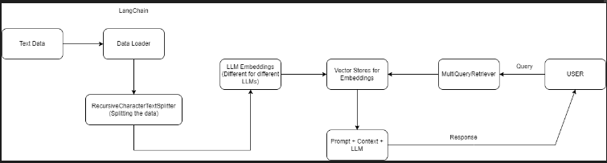

# RAG (Retrieval-Augmented Generation)
This repository contains the implementation of a Retrieval-Augmented Generation (RAG) system using LangChain and LangSmith. The project aims to leverage the capabilities of LangChain for language processing and LangSmith for knowledge retrieval to build a robust system for generating accurate and context-aware responses.

## Table of Contents
- [Introduction](#introduction)
- [Features](#features)
- [Use Cases](#use-cases)
- [Installation](#installation)
- [Vector Stores](#VectorStores)
- [Usage](#usage)
- [LangSmith](#LangSmith)

## Introduction
Retrieval-Augmented Generation (RAG) combines the strengths of retrieval-based and generation-based models to improve the accuracy and relevance of generated responses. This project integrates LangChain and LangSmith to create a powerful RAG system capable of handling complex queries and generating informative answers.

## Features
- **Retrieval-Augmented Generation**: Combines retrieval and generation techniques for better response quality.
- **LangChain Integration**: Utilizes LangChain for advanced language processing and generation.
- **LangSmith Integration**: Employs LangSmith for effective knowledge retrieval.
- **Modular Design**: Easy to extend and customize for various use cases.

## Use Cases
RAG systems have a wide range of applications across various domains. Here are some key use cases:

1. **Question Answering Systems**: Providing accurate and detailed answers by retrieving relevant documents or snippets and generating coherent responses.
2. **Customer Support Chatbots**: Enhancing chatbot responses by integrating real-time data retrieval from FAQs, knowledge bases, and support documents.
3. **Document Summarization**: Creating concise summaries by retrieving key information from long documents and generating coherent summaries.
4. **Content Creation**: Assisting in writing articles, reports, or creative content by retrieving relevant information and generating coherent narratives.
5. **Personalized Recommendations**: Generating personalized suggestions by retrieving user-specific data and generating tailored recommendations.
6. **Educational Tools**: Providing detailed explanations or tutoring by retrieving educational resources and generating informative responses.
7. **Medical and Legal Assistance**: Generating responses based on retrieved medical or legal documents to assist professionals with up-to-date information.
8. **Code Generation and Documentation**: Assisting developers by retrieving relevant code snippets or documentation and generating comprehensive explanations or code completions.
9. **Interactive Storytelling**: Creating dynamic narratives by retrieving contextually relevant story elements and generating continuous storylines.
10. **Translation and Localization**: Enhancing translation accuracy by retrieving contextually similar sentences or phrases and generating precise translations.
11. **Market Research and Analysis**: Summarizing market reports and retrieving relevant data points to generate comprehensive market analysis.
12. **Scientific Research**: Assisting researchers by retrieving relevant scientific papers and generating summaries or explanations of findings.
13. **E-commerce and Product Search**: Enhancing product search capabilities by retrieving relevant product information and generating detailed descriptions or comparisons.
14. **Travel Planning and Recommendations**: Providing personalized travel recommendations by retrieving relevant travel guides and generating tailored itineraries.
15. **Financial Analysis**: Generating financial reports and insights by retrieving relevant financial data and documents.

The following is the pipeline -

a. RAG_pdf_Ollama (RAG document search using Ollama and OpenAI)
1. Extract text from a PDF (used single pdf but can use any number of documents)
2. Chunk the data into k size with w overlap (used 800 and 200).
3. Extract (source, relation, target) from the chunks and create a knowledge store.
4. Extract embeddings for the nodes and relationships (different for OpenAI and Ollama).
5. Store the text and vectors in vector database (used chroma vector store).
6. Load a pre-configured question-answering chain from Langchain to enable Question Answering model.
7. Query your Knowledge store (can also provide prompt templates available on Langchain or custom Prompt Templates).

b. RAG_Q&A_OpenAI 




1. Extract text data from webpages (used beautiful soup).
2. Load the extracted text.
3. Split the text (chunk_size=1000, chunk_overlap=200).
4. Embedding Generation - Extract embeddings for the nodes and relationships (different for OpenAI and Ollama).
5. Store the embeddings and vectors in vector database (used chroma vector store).
6. Make vectorstore as the retriever.
7. Load a pre-configured rag prompt from Langchain hub.
8. Use Lanchain Expression Language to define the processing pipeline for a Retrieval-Augmented Generation (RAG) system.
7. Query your Knowledge store use LangChains Invoke method to execute with given input (here query is the input).

## Installation

To set up the project locally, follow these steps:

1. **Clone the repository**:
   ```bash
   git clone https://github.com/RAG.git
   cd RAG
   
2. **Create a virtual environment:**
   ```bash
   python -m venv venv
   source venv/bin/activate  # On Windows, use `venv\Scripts\activate`

3. **Install dependencies:**
   ```bash
   pip install -r requirements.txt

4. **Set up environment variables:**
   Create a .env file in the root directory and add your API keys and other configuration settings:
   ```bash
   LANGCHAIN_API_KEY=<your_langchain_api_key>
   LANGSMITH_API_KEY=<your_langsmith_api_key>
   LANGCHAIN_ENDPOINT='https://api.smith.langchain.com'
   OPENAI_API_KEY=<your_openai_api_key>
   LANGCHAIN_TRACING_V2='true'

5. **Install Ollama:**

   go to [https://ollama.com/download](https://ollama.com/download) and download ollama which helps in using the different Llama LLM versions

   example:

   ollama pull llama3

   ollama pull mxbai-embed-large

## Vector Stores

- Chromadb


## Usage
### Supported LLMs and Embeddings
**LLMs**
- OpenAI
- Llama
**Embedding Models**
  Embed the data as vectors in a vector store and this store is used for retrieval of the data
- OpenAI 'embedding=OpenAIEmbeddings()'
- Ollama 'OllamaEmbeddings(model_name="llama2")'

### LangChain Expression Language (LCEL)
- LangChain Expression Language, or LCEL, is a declarative way to easily compose chains together. LCEL was designed from day 1 to support putting prototypes in production, with no code changes, from the simplest “prompt + LLM” chain to the most complex chains (we’ve seen folks successfully run LCEL chains with 100s of steps in production).

## LangSmith
Track the model using LangSmith UI

- All LLMs come with built-in LangSmith tracing.
- Any LLM invocation (whether it’s nested in a chain or not) will automatically be traced.
- A trace will include inputs, outputs, latency, token usage, invocation params, environment params, and more.


